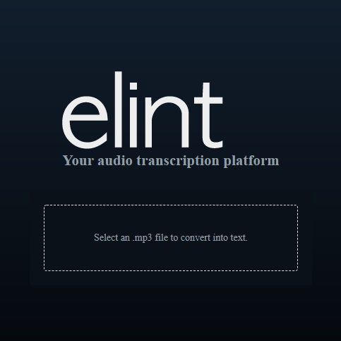

## Install npm packages:

### `npm install`

## Run the project at main directory

### `npm start`

Open [http://localhost:3000](http://localhost:3000) to view it in the browser.

The page will reload if you make edits.

